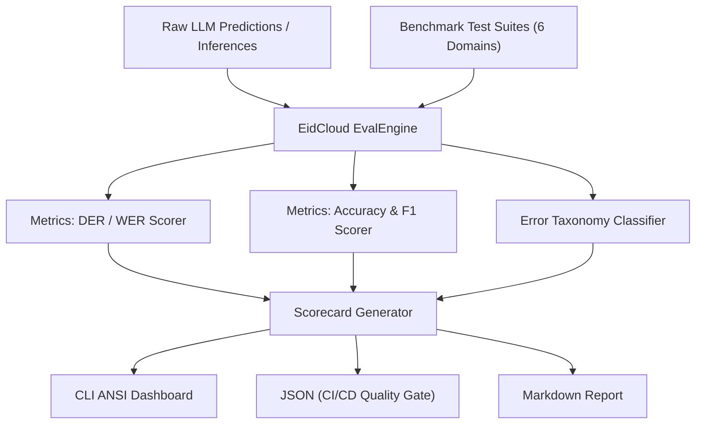

[🇸🇦 العربية](README.ar.md) | [🇬🇧 English](README.md)

# 📊 eidcloud-arabic-eval-bench

Standardized Arabic AI Evaluation & Benchmark Suite for LLMs in pure PHP 8.2+.

[](https://php.net)
[](https://github.com/shadi-alhasan/eidcloud-arabic-eval-bench/releases)
[](LICENSE)
[](https://colab.research.google.com/github/shadi-alhasan/eidcloud-arabic-eval-bench/blob/main/notebooks/quickstart.ipynb)
[](https://github.com/shadi-alhasan/eidcloud-arabic-eval-bench/actions)

---

## 📌 Overview

**eidcloud-arabic-eval-bench** is a production-grade, zero-dependency Arabic AI benchmark suite designed to evaluate Large Language Models (LLMs) on high-stakes Arabic linguistic, structural, and domain-specific capabilities. 

Built entirely in modern PHP 8.2+ with strict typing and no external runtime vendor packages, it integrates seamlessly into enterprise CI/CD pipelines, local LLM evaluation workflows (e.g. Ollama, vLLM, OpenAI-compatible APIs), and automated quality gates.



---

## 🎯 6 Core Evaluation Capabilities

1. **Structured JSON Extraction (`json`)**:
   - Assesses the model's ability to extract complex structured JSON schemas from unstructured, informal, or conversational Arabic texts (invoices, medical appointments, flight bookings).
   - Computes recursive key/value exact matching, structural schema conformity, and field-level F1.

2. **Diacritization and Tashkeel (`diacritization`)**:
   - Measures fine-grained Tashkeel accuracy using Diacritization Error Rate (**DER**) and Word Error Rate (**WER**).
   - Evaluates base letters and attached Harakat (Fatha, Damma, Kasra, Sukun, Tanween, Shadda).

3. **Classical Arabic and Dialectal Nuance (`dialectal`)**:
   - Evaluates comprehension of regional idioms, colloquial expressions, and semantics across Levantine, Egyptian, Gulf, and Maghrebi dialects.

4. **Arabic Grammar, Morphology and Syntactic Reasoning (`grammar`)**:
   - Tests declension (*I'rab*), dual/plural concord (*Muthanna* and *Jam' Muzakkar Salim*), *Inna* and its sisters, five verbs (*al-Af'al al-Khamsah*) in jussive moods, and number-counted noun concord.

5. **Arabizi / Franco-Arabic Normalization (`arabizi`)**:
   - Evaluates transliteration and semantic translation fidelity of Arabizi (Arabic chat alphabet utilizing numbers like 2, 3, 5, 7) into standard Arabic.

6. **Financial, Legal, and Technical Domain Understanding (`domain`)**:
   - Assesses deep terminology and concept accuracy in Arabic enterprise verticals (venture capital, contract law, machine learning, and cloud architecture).

---

## 🚀 Installation & Requirements

- **PHP 8.2 or higher**
- Required standard extensions: `ext-mbstring`, `ext-json`
- **Zero external vendor packages required.**

Clone the repository:

```bash
git clone https://github.com/shadi-alhasan/eidcloud-arabic-eval-bench.git
cd eidcloud-arabic-eval-bench
```

Verify your environment and run the test suite:

```bash
php tests/run_tests.php
```

---

## 💻 CLI Usage

The executable CLI tool is located at `bin/eidcloud-ar-eval`.

### 1. View Available Suites and Help

```bash
php bin/eidcloud-ar-eval --help
php bin/eidcloud-ar-eval suites
```

### 2. Run Baseline Dry-Run Benchmark

```bash
php bin/eidcloud-ar-eval run --suite=all --dry-run
```

### 3. Evaluate Predictions Against Suites

```bash
# Evaluate specific suites:
php bin/eidcloud-ar-eval run --model="ollama/qwen" --suite=grammar,json

# Score model output from file:
php bin/eidcloud-ar-eval score --predicted=predictions.json --suite=all
```

### 4. CI/CD Integration with JSON Output

Output machine-readable JSON reports directly to stdout or a file:

```bash
php bin/eidcloud-ar-eval score --predicted=predictions.json --json --output=scorecard.json
```

Exit code is `0` when overall accuracy meets or exceeds 70%, and `1` if thresholds fail.

### 5. Generate Markdown Scorecards for PRs

```bash
php bin/eidcloud-ar-eval score --predicted=predictions.json --markdown --output=scorecard.md
```

---

## 📊 Programmatic PHP API

You can also use the evaluation engine directly inside your PHP applications:

```php
use EidCloud\ArabicEvalBench\EvalEngine;

$engine = new EvalEngine();

// Predictions mapped by test case ID or suite
$predictions = [
    'json' => [
        'json_001' => [
            'merchant' => 'شركة الأمل للتجارة',
            'items_count' => 3,
            'total_amount' => 15000,
            'currency' => 'ريال سعودي',
            'payment_method' => 'نقداً',
            'buyer' => 'أحمد محمد',
            'date' => '2026-05-15'
        ]
    ]
];

$scorecard = $engine->evaluate($predictions, suites: 'json', modelName: 'my-custom-model');

// Access results
echo $scorecard->toCliOutput();
$jsonReport = $scorecard->toJson();
$summary = $scorecard->toArray()['summary'];
echo "Overall Accuracy: " . $summary['overall_accuracy'] . "%\n";
```

---

## 🧪 Testing

Run the zero-dependency test runner:

```bash
php tests/run_tests.php
```

Or via composer:

```bash
composer test
```

---

## 👨‍💻 Author & Maintainer

- **Eng. MHD. Shadi AL-Hasan**  
  GitHub: [@shadi-alhasan](https://github.com/shadi-alhasan)

---

## 📄 License

This project is licensed under the MIT License - see the [LICENSE](LICENSE) file for details.

---

## 👤 Author & Maintainer

**Eng. MHD. Shadi AL-Hasan**  
- **Role:** Executive CTO & Enterprise Solutions Architect  
- **Email:** [mhd.shadi.alhasan@gmail.com](mailto:mhd.shadi.alhasan@gmail.com)  
- **Phone / WhatsApp:** [+963934005922](tel:+963934005922)  
- **Location:** Damascus, Syria  
- **GitHub:** [shadialhasan](https://github.com/shadialhasan)  

---

## 📄 License

This project is licensed under the MIT License - see the [LICENSE](LICENSE) file for details.  
Copyright (c) 2026 **MHD. Shadi AL-Hasan**. All rights reserved.
